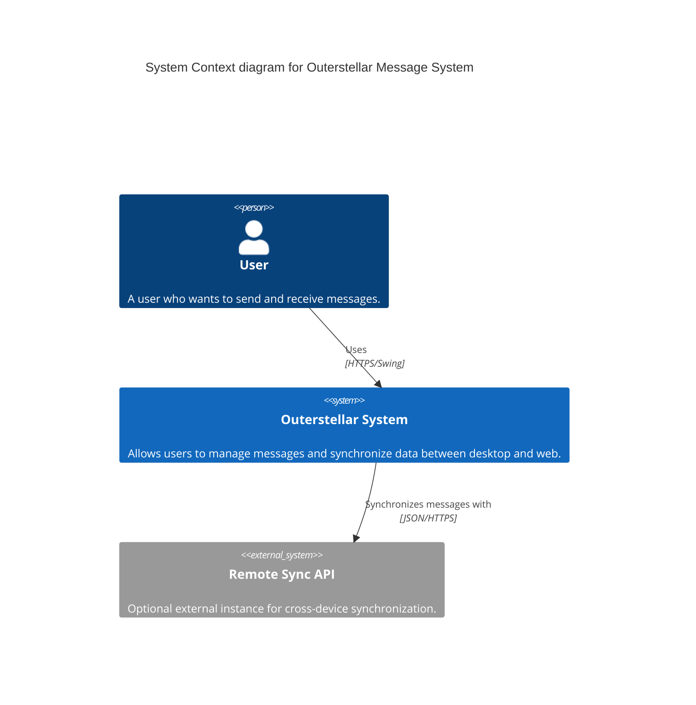
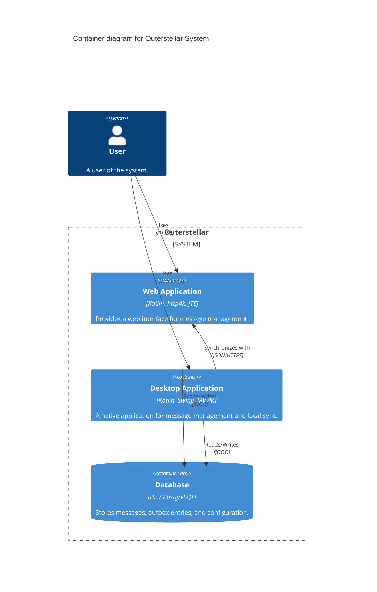
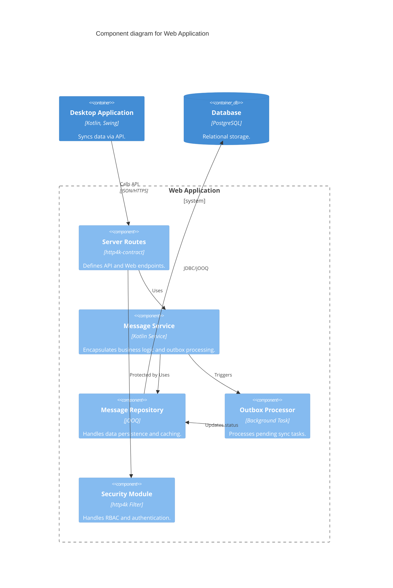

### Outerstellar Starter Architecture (C4 Model)

This document provides a comprehensive overview of the Outerstellar starter project architecture using the C4 Model (Context, Container, Component).

---

### 1. System Context Diagram
The System Context diagram shows the Outerstellar system and its relationship with users and external systems.

---

### 2. Container Diagram
The Container diagram shows the high-level software containers that make up the Outerstellar system.

---

### 3. Component Diagram (Web Application)
The Component diagram shows the internal structure of the Web Application container.

---

### 4. Code / Module Structure
The project is organized into several highly decoupled Maven modules:

- **`core`**: Domain models (`StoredMessage`), Service interfaces, and shared business logic.
- **`persistence`**: Implementation of repositories using jOOQ, Flyway migrations, and Caffeine caching.
- **`security`**: Authentication logic, Role-Based Access Control (RBAC), and user models.
- **`api-client`**: Client-side synchronization logic using Resilience4j (Retry/Circuit Breaker).
- **`web`**: The http4k server, JTE templates, and Web Component-based UI.
- **`desktop`**: The Swing application following the MVVM architecture.

---

### 5. Key Architectural Patterns
- **Transactional Outbox**: Ensures eventual consistency between local database updates and remote synchronization.
- **MVVM (Desktop)**: Decouples UI state from business logic in the Swing client.
- **Contract-First API**: Uses `http4k-contract` for typesafe routing and automatic OpenAPI documentation.
- **Optimistic Locking**: Uses a `version` column to prevent lost updates during concurrent modifications.
- **Read/Write Splitting**: Support for primary and replica database routing in the persistence layer.
- **Observability**: Integrated OpenTelemetry for tracing and Micrometer for metrics.
